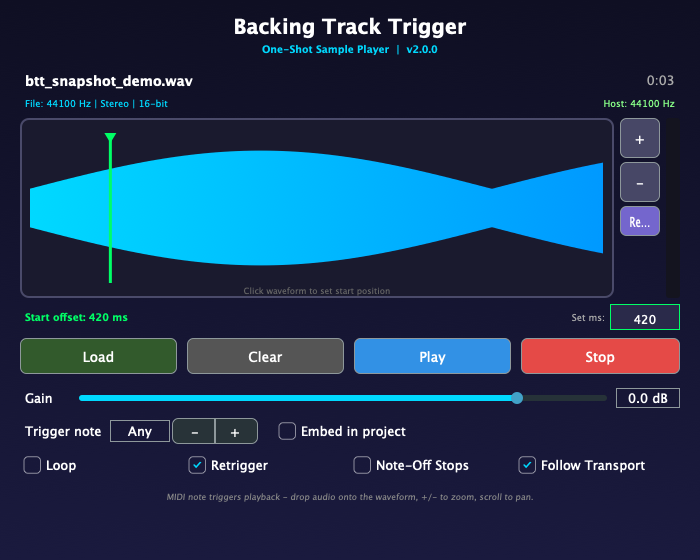

# Backing Track Trigger

A focused one-shot sampler plugin (VST3 / AU / Standalone) for playing backing
tracks in sync with a score. Load a long audio file — a backing track, stem, or
vocal part — and trigger it from a single MIDI note. Built for MuseScore 4, but
it works in any DAW.




## Features

- **One-shot playback** — a MIDI note plays the whole sample at original pitch.
- **Sample-accurate triggering** — playback starts on the exact sample of the
  note, so it stays tight against the MuseScore / DAW transport.
- **Transport-aware** — automatically stops and rewinds when the host stops or
  rewinds (toggleable).
- **Start offset** — click the waveform, type a millisecond value, zoom (`+`/`-`)
  and pan (scroll wheel) to skip silence or count-ins precisely.
- **Gain, loop, fades** — output level (−60…+12 dB), loop toggle, and short
  click-free fade in/out.
- **Trigger note** — fire on any note, or restrict to one specific MIDI note.
- **Note-off behaviour** — play to completion (default) or fade out on release.
- **Drag-and-drop** — drop an audio file straight onto the waveform.
- **Automatic resampling** — high-quality Lagrange interpolation to the host
  rate, always from the pristine source.
- **Portable projects** — optionally embed the audio (lossless FLAC) inside the
  saved state so the backing track travels with the score.
- **Output meter** and a clean dark UI.
- **RT-safe** — loading a sample never glitches or races the audio thread.
- **Formats** — VST3, AU (macOS), and a Standalone app.
- **Supported files** — WAV, AIFF, MP3, FLAC, OGG.

## Use with MuseScore 4

1. Add this plugin as an instrument on a dedicated staff/track.
2. Load your backing track (or drag it onto the waveform).
3. Place a single whole note at the bar where the track should start.
4. Press play — the track plays in sync. Use the start offset to trim any
   silence at the head of the file.

To share the score with the audio baked in, tick **Embed in project** before
saving.

## Building

### Prerequisites

- CMake 3.22+
- A C++17 toolchain
  - **macOS:** Xcode (command-line tools)
  - **Windows:** Visual Studio 2022
  - **Linux:** GCC/Clang + the dev packages listed below

### Get the source (with JUCE)

JUCE is a git submodule. Either initialise it:

```bash
git clone --recurse-submodules https://github.com/leedale30/BackingTrackTrigger.git
cd BackingTrackTrigger
git submodule update --init --recursive
```

…or fetch a pinned release directly (this is what CI does):

```bash
git clone https://github.com/leedale30/BackingTrackTrigger.git
cd BackingTrackTrigger
git clone --depth 1 --branch 8.0.8 https://github.com/juce-framework/JUCE.git JUCE
```

### Linux build dependencies

```bash
sudo apt-get install -y \
  libasound2-dev libjack-jackd2-dev libfreetype6-dev \
  libx11-dev libxcomposite-dev libxcursor-dev libxext-dev \
  libxinerama-dev libxrandr-dev libxrender-dev \
  libfontconfig1-dev libglu1-mesa-dev
```

### Configure & build

```bash
cmake -B build -DCMAKE_BUILD_TYPE=Release
cmake --build build --config Release --parallel
```

The plugin is copied to your user plugin folders automatically
(`COPY_PLUGIN_AFTER_BUILD`). To install manually on macOS:

```bash
cp -r "build/BackingTrackTrigger_artefacts/Release/VST3/Backing Track Trigger.vst3" \
      ~/Library/Audio/Plug-Ins/VST3/
```

## Tests

```bash
cmake -B build -DCMAKE_BUILD_TYPE=Release -DBTT_BUILD_TESTS=ON
cmake --build build --target BackingTrackTriggerTests
ctest --test-dir build --output-on-failure
```

The suite covers loading + resampling, sample-accurate triggering, output
bounds, the gain parameter, and state round-trips (both by file path and with
embedded audio).

## Continuous integration

GitHub Actions builds VST3/AU/Standalone on macOS, Windows, and Linux, validates
the plugin with [pluginval](https://github.com/Tracktion/pluginval) at strictness
level 8, runs the unit tests, and uploads the built plugins as artifacts. See
[`.github/workflows/build.yml`](.github/workflows/build.yml).

## Controls reference

| Control | What it does |
| --- | --- |
| **Load / Clear** | Load or unload an audio file. |
| **Play / Stop** | Audition from the start offset / stop with a fade. |
| **Gain** | Output level, −60 to +12 dB. |
| **Trigger note** | Which MIDI note fires playback (`Any` = all notes). |
| **Loop** | Repeat until note-off / stop. |
| **Retrigger** | A new note restarts playback from the offset. |
| **Note-Off Stops** | Releasing the key fades the sample out. |
| **Follow Transport** | Stop/rewind when the host transport stops. |
| **Embed in project** | Save the audio inside the project for portability. |
| **Waveform** | Click to set start offset; drag-drop to load; `+`/`-` zoom; scroll to pan. |

## License

MIT — see [LICENSE](LICENSE). JUCE is licensed separately under its own terms.
